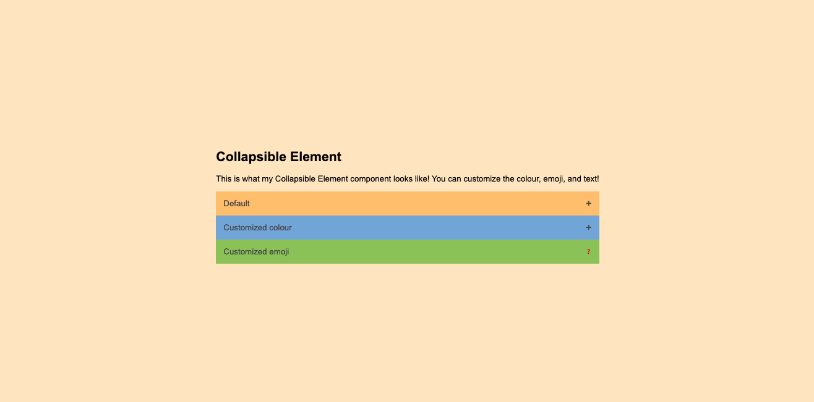
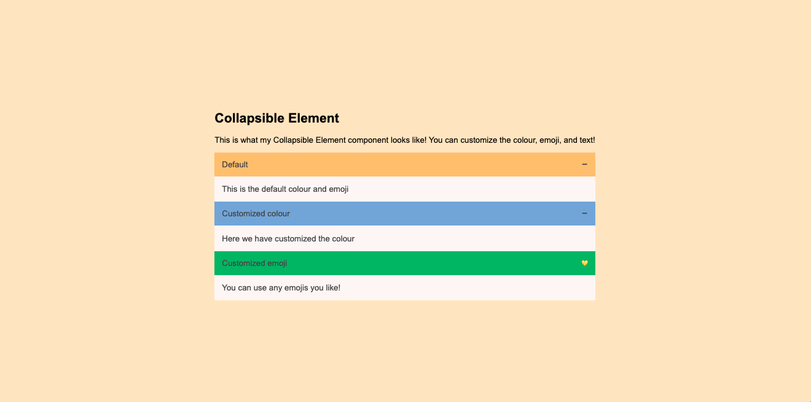

# Collapsible Element Web Component

## Overview

The Collapsible Element is a customizable web component that allows you to create collapsible sections with ease. You can customize the button text, button color, hover color, and emojis to match the style of your website or application.

## Features

- **Easy Integration:** Simply include the `collapsible-element.js` script in your HTML file, and you're ready to use the Collapsible Element.

- **Customizable Button:** Change the button text to suit your content.

- **Color Customization:** Customize the button color and hover color to match your design.

- **Emoji Support:** Add a touch of personality to your collapsible sections by using custom emojis for both collapsed and expanded states.

## Usage

1. **Include the Script:**
   ```html
   <script src="./collapsible-element.js"></script>
   ```

2. **Create Collapsible Elements:**
   ```html
   <collapsible-element button-text="Default" panel-content="This is the default color and emoji"></collapsible-element>

   <collapsible-element button-color="#79A7D3" hover-color="#6883BC" button-text="Customized color" panel-content="Here we have customized the color"></collapsible-element>

   <collapsible-element collapsed-emoji="❓" expanded-emoji="💛" button-color="#97BC62" hover-color="#2BAE66" button-text="Customized emoji" panel-content="You can use any emojis you like!"></collapsible-element>
   ```

## Attributes

- `button-text`: Specifies the text for the collapsible button.
- `button-color`: Sets the color of the button.
- `hover-color`: Sets the color when the button is hovered over.
- `collapsed-emoji`: Emoji to display when the panel is collapsed.
- `expanded-emoji`: Emoji to display when the panel is expanded.
- `panel-content`: The content that will be displayed when the panel is expanded.

## Example

Check the provided `index.html` file for a quick example of how to use and customize the Collapsible Element.



